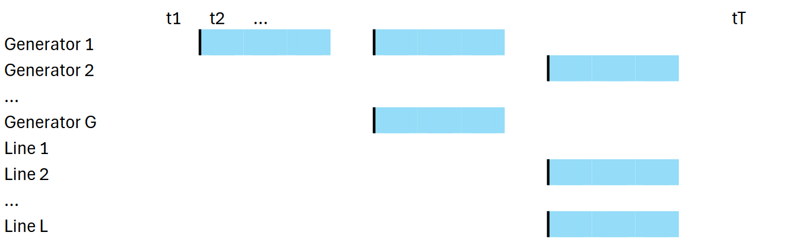
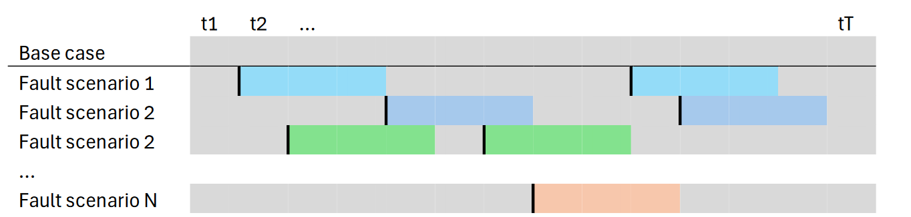

[Home](index.md)
# Fault scenario analysis


## Introduction

The purpose of the fault scenario module is to enable assessments of the impacts of faults, and thereby assessments of power system adequacy.

This is done through simulations of fault scenarios.

### Definitions
- Fault situation: A situation when one or more components in the system is at fault.
- Fault scenario: A combination of fault situations occuring at different times wihtin a long time horizon (e.g. 30 years)


<p>

<br/><b>Figure 1</b>: Illustration of multiple fault situations (indicated with blue colour) making up a single fault scenario.
</p>
<p>

<br/><b>Figure 2</b>: Illustration of fault scenarios. Periods containing one or more fault situations are indicated with colour different from gray.
</p>

### Core assumptions
- Fault situations have an impact on the system only during the fault. Longer-term effects are ignored.

Simulations are run only for timesteps with faults, using the results from the baseline simulation as starting point. This is to save time possible with the assumption above. 

## Procedure
The generasl provedure for running fault scenario analyses with PowerGAMA is as follows:
1. Create baseline model and run baseline simulation
    - results are saved to sqlite file
2. Create fualt scenarios
3. Run simulations with faults
    - only time periods with faults are re-run
4. Inspect results

## Example script
This is the test script included with the code
```python
import powergama
import powergama.fault_scenarios as fs

# Fault specs:
fault_spec_generators = {
    "fault_rate": 0.05, 
    "fault_duration": 4, 
    "fault_sizes": {None: 100},
    }
scenario_seeds = [1, 2]  # two fault scenarios

# 0. Read input data
gridmodel_base = <read grid data>
dirname = <folder where to keep fault scenarios and simulation results>

# 1. Run baseline simulation and save result to database
base_db_loc = pathlib.Path(dirname).absolute() / "base_powergama.sqlite3"
lp_base = powergama.LpProblem(gridmodel_base, lossmethod=1)
res_base = powergama.Results(gridmodel_base, base_db_loc, replace=True)
lp_base.solve(res_base, solver="glpk")

# 2. Create fault scenario files:
fault_spec = fs.FaultSpec(spec_generators=fault_spec_generators)
failure_dir = pathlib.Path(dirname).absolute() / "faults"
fs.create_fault_scenarios(gridmodel_base, failure_dir, fault_spec=fault_spec, seed_list=scenario_seeds)

# 3 Run simulations with faults (and save results to sql-files)
full_profiles = fs.FullProfiles()
full_profiles.stored_profiles = gridmodel_base.profiles
full_profiles.timedelta = gridmodel_base.timeDelta
full_profiles.stored_storagevalue_time = gridmodel_base.storagevalue_time
full_profiles.storagevalue_filling = gridmodel_base.storagevalue_filling
for scen in scenario_seeds:
    fault_scenario_dir = failure_dir / f"fault_scenario_{scen}"
    fault_scenario_dir.mkdir(exist_ok=True)
    fault_scenario_file = failure_dir / f"fault_scenario_{scen}.txt"
    fs.run_fault_simulation(
        gridmodel_base,
        full_profiles,
        fault_scenario_file=fault_scenario_file,
        failure_dir=fault_scenario_dir,
        db_base=base_db_loc,
        solver="glpk",
    )

# 4 Inspect results
res_nodes_base = fs.specify_storage.load_table_from_res(base_db_loc, "Res_Nodes")
base_node = copy.deepcopy(res_nodes_base)
# combine results about load shedding from all fault situations:
loadshedding_all = pd.DataFrame()
for scen in scenario_seeds:
    fault_scenario_dir = failure_dir / f"fault_scenario_{scen}"
    for subfolder in pathlib.Path(fault_scenario_dir).glob("failure_*/"):
        res_table = fs.specify_storage.load_table_from_res(
            subfolder / "failure_case_combined.sqlite3", "Res_Nodes")
        if (res_table["loadshed"] > 0).any():
            # update result with data from this fault situation:
            mask = base_node["timestep"].isin(res_table["timestep"])
            base_node.loc[mask, :] = res_table.drop(columns="fault_start").set_index(base_node.loc[mask].index)
    loadshedding_all[scen] = base_node["loadshed"]

loadshedding_sums = loadshedding_all.sum()
```


## References

