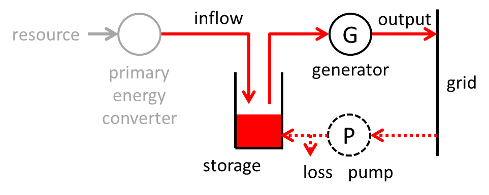
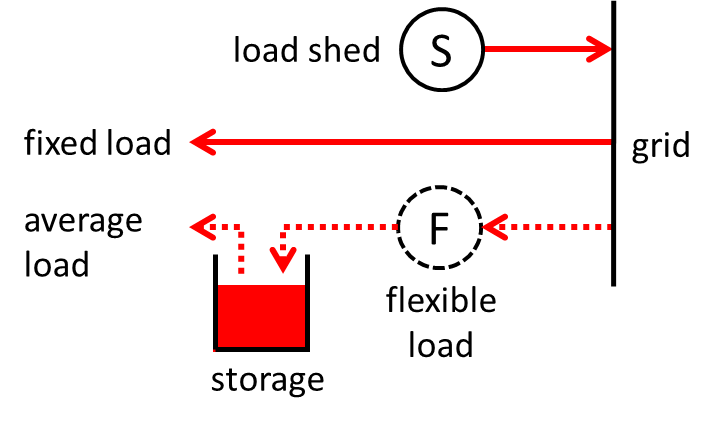

# Physical description

This section gives a brief overview of the physical description of the
power system grid and market. This description includes a number of
implicit assumptions and is the basis for the PowerGAMA software tool.

## Electricity market

The market is considered perfect such that generators with the lowest
marginal costs are always favoured. That is, power is assumed traded
such that the overall cost of generation is always minimised.

The cost of generation is assumed to be the marginal cost times power
output for all generators. Start-up costs and ramp rates are not
considered.

For generators with storage, the marginal cost is given by storage
values, which depends on filling level. Storage values are inspired by
watervalues used for modelling and planning of production for hydro
power generators with storage [@fosso1999; @wolfgang2009]. Storage
values reflect the value of adding power inflow to the storage. The
generator will therefore produce if the cost of alternative generation
is higher than the storage value at any given time. This is identical to
saying that a generator with storage will produce power if the nodal
price is higher than the storage value.

Storage value curves are given as input, as functions of storage
filling level and time. If the storage is nearly full, the storage value
is low, since adding to the storage may lead to energy spillage. If the
storage is nearly empty, the storage value is high. For predictable
seasonal or daily inflow patterns, the storage value is low just before
a peak in the inflow, and high before a dip. An illustration of how the
storage values may vary with filling level and time is given in
[Figure 1](#fig_storagevalues) for solar concentrated power with small
storage (hours) and for hydro power with large reservoir for seasonal
storage.

<b>Figure 1</b>: Illustration of typical storage values with dependence on filling level (left) and time variation for solar power with small storage (middle) and hydro with large storage (right).

## Power generation

 
<b>Figure 2:</b> Power generation model.

<b>Table 1:</b> Generator parameters: Inflow, storage capacity and marginal cost for different types of generators.

  Generator type      | Inflow             |  Storage           |   Price
  --------------------|--------------------|--------------------|---------------
  Fuel based (alt 1)  | 0                  |  Infinity          |   Constant cost
  Fuel based (alt 2)  | Available capacity |  0                 |   Constant cost
  Wind                | Available power    |  0                 |   0
  Photovoltaic        | Available power    |  0                 |   0
  CSP                 | Available power    |  Thermal storage   |   Storage value
  Hydro               | Water inflow       |  Reservoir capacity|   Storage value

Power generators are described by the same universal model, illustrated
in [Figure 2](#fig_generator_model). Different types of power plants are
simply distinguished by their different parameters, as indicated in
[Table 1](#tab_generator_parameters). 
PowerGAMA assumes that the power
inflow (average value and time profile) is given as input, and so the
resource and primary energy converter parts included in
[Figure 2](#fig_generator_model) are not directly relevant.

Wind and solar PV power are similar. The inflow represents the available
electrical power in the wind or solar radiation. Zero storage implies
that power not used is lost. The cost is zero, such that unless
restricted by grid constraints, available power will always be output.
solar CSP and hydro power *without* any storage can also be modelled in
this way.

CSP and hydro *with storage* will have a non-zero storage and a price
set such as to ensure a sensible scheduling of the power output. If the
storage is close to its upper limit, the price will be low and if it is
low, the price will be high. This dependence on the storage filling
level is exactly what the storage value provides. It gives the threshold
price value for when the generator should produce power at a given
storage filling level. The use of storage value is well established for
scheduling of hydro power production. Storage values also depend on the
time: The value of stored water is less just before the spring floods
than in the autumn, and the value of stored CSP energy is less in the
late morning (around 9am) than in the evening. However, this dependence
will be ignored in this software.

For fuel based generators, such as coal, gas, oil, nuclear and biomass,
there are two alternative ways to specify the inflow and storage
parameters. *Alternative One* is to set inflow to zero and storage to
infinity with an initial value also to infinity. Then there is always
fuel available in the storage and output is restricted by generator
output limits only. With this approach there is no spilled energy, but
storage is updated each time step. *Alternative Two* is to set inflow
equal to available capacity and storage to zero. This allows available
capacity to vary throughout the year, which may be relevant at least for
nuclear power and perhaps biomass. But it will wrongly indicate spilled
energy whenever actual output is less than the available capacity.

For generators with storage, a pump, or more generally, an energy
storage charger, may be included in the model. Technically, a pump is
represented as a generator with zero or negative output that takes
energy from the grid and adds to the storage, with a certain amount of
loss.

The generator model is described by the following parameters:

-   Power inflow ($P_\text{inflow}$)
-   Energy storage capacity ($E_\text{max}$)
-   Energy in storage ($E$)
-   Generator capacity ($P_\text{max}$)
-   Generator minimum production ($P_\text{min}$). Normally, this is
    value is zero.
-   Generator output ($P_\text{output}$)
-   Generator available power ($P_\text{avail}$)
-   Pumping capacity ($P_\text{pump,max}$). In most cases, this value is
    zero (no pumping)
-   Pumping demand ($P_\text{pump}$)
-   Pumping efficiency ($\eta_\text{pump}$)

Available power is determined by the power inflow and the amount of
stored energy, and is given by
$P_\text{avail} = P_\text{inflow} + \frac{E}{\Delta t},$ where
$\Delta t$ is the time interval considered.

Generator output is limited both by the available power and by the
generator capacity, as well as the minimum production. Regarding the
upper limit, there is a difference depending on generator type. From the
definition of power capacity for PV panels, it may occur in good
conditions that the power output is higher than the nominal capacity. In
this case output power should not be constrained by the nominal
capacity, but only by the available power. In fact, this is true for all
generators with zero storage. In general, therefore, the upper limit on
generator output is given as 

$$\begin{aligned}
    \text{No storage generators:} \quad && P_\text{limit} = P_\text{avail},
    \\
    \text{Non-zero storage generators:} \quad && P_\text{limit} = \min[P_\text{avail}, P_\text{max}],
    \\
    \text{Infinite storage generators:} \quad && P_\text{limit} = P_\text{max}.\end{aligned}$$

The constraint on generator power output can then be written

$$P_\text{min} \le P_\text{output} \le P_\text{limit}.$$

### Power inflow

Power inflow is important for renewable energy sources such as wind, sun
and rain. In general the energy resource may be converted by a primary
energy converter (e.g. wind turbine) into a more readily exploitable
energy form. The available power for electricity generation is generally
less than the power in the primary resource. PowerGAMA assumes that
power inflow data is provided by the user. For wind power, the inflow
depends on the wind speed and characteristics of the wind turbines.
Similarly, for solar power the inflow depends on solar radiation and
characteristics of the PV or CSP units. For hydro power, the inflow
depends on precipitation, temperature, topography and soil conditions.

### Pumping

<b>Figure 3:</b> Generator with storage and pumping. The red dots represent three
different situations with different nodal price at the generator
associated node. The solid line is the storage value curve, and the
dotted line is the same curve offset by a
dead-band.

The implementation of pumping is illustrated in
[Figure 3](#fig_pumping_model). If the price is high, the generator will
produce power, reducing the storage filling level. If the price is below
the storage value the generator will be idle, allowing the storage to
fill up (due to inflow). If the price is also lower than the storage
value minus a certain dead-band value, the pump will add energy to the
storage, increasing the filling level.

The dead-band ensures that the generator-pumping system doesn't
continuously alternate between generating and pumping, and indirectly
takes into account the losses associated with pumping.

### Storage dynamics

The energy in the storage $E$ is given by the differential equation
$$\frac{dE}{dt} = P_\text{inflow} - P_\text{output} + \eta_\text{pump}P_\text{pump}, 
    \quad 0 \le E \le E_\text{max},$$ where $E_\text{max}$ is the
maximum capacity of the storage. Discretised, this equation is written
$$E(t+\Delta t) = \max[\min[E(t) 
    + \Delta t (P_\text{inflow} - P_\text{output} + P_\text{pump}), 
    E_\text{max}],0]$$

## Power consumption

Power consumption is modelled as loads connected to different nodes with
a given average power demand and a certain profile which describes the
time dependent variation, i.e. how the power consumption varies from
time step to time step. Any number of demand profiles can be specified
and any number of loads can be connected to each node.

The full consumption model is illustrated in
[Figure 4](#fig_load_model), with further explanations in the following.

<b>Figure 4:</b> Power consumption model.

### Load shedding

Power demand that for some reason cannot be supplied is handled by
adding high cost generators at all nodes with loads attached. This
ensures that the optimisation has a solution. The high cost further
ensures that these are used only when strictly necessary. Output from
these "generators" is interpreted as load shedding.

### Flexible load

Flexible loads are represented in a similar way to flexible generation,
by means of a storage and storage value curves.

The main parameters specifying a flexible load are:

-   The ratio of flexible energy to total energy demand
    ($P_\text{flex}^\text{avg}/P^\text{avg}$)
-   The flexibility on/off ratio, i.e. ratio of average load relative to
    the maximum load
    ($x_\text{flex} = P_\text{flex}^\text{avg} / P_\text{flex}^\text{max}$)
-   The maximum energy flexibility/storage ($E_\text{flex}^\text{max}$),
    given in MWh
-   The storage value curve (normalised shape)
-   The storage base value (absolute value), given in €/MWh

The amount of power served to the flexible load, $P_\text{flex}$ is
determined by the optimisation. Given this value, the energy in the
storage $E_\text{flex}$ for the flexible load is computed according to
$E_\text{flex}(t+\Delta t) = E_\text{flex}(t) + \Delta t (
        P_\text{flex}-P_\text{flex}^\text{avg} ),$ where $\Delta t$ is
one time step. The storage filling level $f_\text{flex}$ is the relative
value of energy in the storage compared to the maximum flexible energy
(storage capacity),
$f_\text{flex} =  \frac{E_\text{flex}}{E_\text{flex}^\text{max}}.$ If
$f_\text{flex}>0.5$ then the load is "over-served", and if
$f_\text{flex}<0.5$ then it is "under-served". It is assumed that the
initial value of the filling level is 0.5.

Flexibility value curves specify flexibility values as functions of
flexibility status. This is akin to storage values versus filling level
for storage generators. An example of such a curve is shown in
[Figure 5](#fig_flexvalue_curve). If the associated nodal price is lower
than the flexibility value, then the load is served. This in turn
increases the flexibility status.

<b>Figure 5:</b> Storage value curve for flexible load. The red dots represent nodal prices in two different operating points.

## Grid power flow

The power balance at each node requires that all generation minus all
consumption equals the net power flow *out* of the node. Additionally,
AC power flow in the grid obeys power flow equations, and is moreover
constrained by capacity limits. These physical relationships and
constraints can be formulated by a set of equations and inequalities.
Together with a cost function which describes the total cost of
generation, the problem of minimising the cost becomes an optimal power
flow (OPF) problem. In our case we approximate this problem using
only linear relationships, which gives a linear programming (LP) problem
formulation. This must be solved time step by time step, where time
steps are coupled due to the presence of storage.

DC branches (i.e. HVDC connections) are considered fully controllable
such that power flow is a free variable only constrained by the branch
capacity.

The linearised power flow equations are obtained as follows.

Assume there are $N$ buses, enumerated from 1 to $N$. Denote branches by
double indices referring to endpoint buses. The impedance on the branch
between node $i$ and $j$ is thus written $z_{ij} = r_{ij} + j x_{ij}$,
where $i,j \in \{1,2,\dots, N\}$. From these impedances, the bus
admittance matrix $Y$ may be constructed:

$$Y_{ij} = G_{ij}+jB_{ij} = \bigg\{ \begin{array}{ll} 
        y_{ii} + \sum_{n\neq i} y_{ni}  & i=j, \\
        -y_{ij}                 & i\neq j,
    \end{array}$$ 

where $y_{ij} = g_{ij} + j b_{ij} = \frac{1}{z_{ij}}$
is the admittance of the branch between $i$ and $j$.

The AC power flow equations are 

$$\begin{split}
    P_k & = \sum_{J=1}^N |v_k| |v_j| \Bigl(G_{kj}\cos(\theta_k-\theta_j) + B_{kj}\sin(\theta_k-\theta_j) \Bigr),
    \\
    Q_k & = \sum_{J=1}^N |v_k| |v_j| \Bigl(G_{kj}\sin(\theta_k-\theta_j) - B_{kj}\cos(\theta_k-\theta_j) \Bigr).
\end{split}$$ 

Here, $P_k$ and $Q_k$ are the net active and reactive
power flow *into* node $i$. To arrive at the linearised equations, the
following approximations are made:

-   phase angle differences are small, so
    $\sin(\theta_i-\theta_j)\approx \theta_i-\theta_j$, and
    $\cos(\theta_i-\theta_j)\approx 1$
-   voltage deviations are small, so $|v| \approx 1$ in per units system
-   branch resistance is small compared to reactance, so
    $z_{ij} \approx j x_{ij}$
-   shunt reactances are small, so ignoring self-admittance
    $y_{ii}\approx 0$

The last two approximations imply that $Y_{ij}\approx jB_{ij}$. The
reactive power flow equation becomes trivial, and the power flow
equations reduce to $$P_k  = \sum_{j=1}^N   B_{kj}(\theta_k-\theta_j).$$
This is the linearised power flow equation. On matrix form it can be
written 

$$
\Delta P = B^\prime \Delta\theta,
$$ 

where $\Delta P$ is the
net power into a node (i.e. production minus consumption), and
$\Delta\theta$ is the angle relative to the angle of a chosen reference
node. The $B^\prime$ matrix is related to the $B$ matrix.

The net power flow into a node $\Delta P = [P_k]$ is the sum of
generation, demand, load shedding and hvdc power inflow:

$$
P_k  = \sum_{j=1}^{N_\text{gen}} P_j^\text{gen}
            - \sum_{j=1}^{N_\text{pump}} P_j^\text{pump}
            +\ P^\text{shed}
            +\sum_{j=1}^{N_\text{dc}} P_j^\text{dc}
            -\sum_{j=1}^{N_\text{cons}} P_j^\text{cons},
$$ 

where
$P_j^\text{gen}$ is generator output, $N_\text{gen}$ is number of
generators at the given node, $P_j^\text{pump}$ is pump demand,
$N_\text{pump}$ is number of pumps at the given node, $P^\text{shed}$ is
amount of load shedding (unfulfilled demand), $P_j^\text{dc}$ is inflow
on DC branches (positive or negative), $N_\text{dc}$ is number of DC
branches connected to the given node, $P_j^\text{cons}$ is consumer
demand, and $N_\text{cons}$ is number of consumers at the given node.

Power flow $P_B$ on each branch is computed by the matrix equation

$$
P_B = (D A) \Delta\theta,
$$ 

where $D$ is a diagonal matrix with
elements given by the branch susceptance $D_{mm} =-b_m$, and $A$ is the
node-arc incidence matrix.

# Optimisation problem

A linear objective function is used in order to ensure fast optimisation that converges, with the practical benefit that it also requires fewer input parameters. The set of variables to be determined by the optimisation are 

$$  X = \{P_g^\text{gen}, P_p^\text{pump},P_f^\text{flex}, P_n^\text{shed}, \theta_n, P_j \}, \label{eq_variables} $$ 

where $g\in \mathcal{G}$, the set of generators; $p\in \mathcal{P}$, the set of pumps; $f\in \mathcal{F}$, the set of flexible loads; $n\in \mathcal{N}$, the set of nodes. $j\in \mathcal{B}$, the set of AC and DC branches. The objective of the optimisation is expressed in terms of an objective function, which in our case is 

$$\begin{split}  F = & \sum_{g\in \mathcal{G}} c_g^\text{gen} P_g^\text{gen} - \sum_{p\in \mathcal{P}} c_p^\text{pump} P_p^\text{pump} \\\\ & - \sum_{f\in \mathcal{F}} c_f^\text{flex} P_c^\text{flex}       + \sum_{n\in \mathcal{N}} c^\text{shed} P_n^\text{shed},        \end{split} %\label{eq:objectivefunction} $$ 

where $c_g$ is the cost of generator $g$, $c_p^\text{pump}$ is the cost of pump $p$, $c_f^\text{flex}$ is the cost of flexible load $p$, and $c^\text{shed}$ is the fixed cost of load shedding. As discussed in the [\[section on energy storage\]](./input_data.md#generators), these cost parameters are determined by the fuel price for generators without storage, and by storage values in the other cases. The negative sign in front of pumping and flexible load means that increasing their value reduces the objective function.  However, the energy balance constraint (see below) implies that power for pumping or flexible load must be compensated by generation elsewhere. So whether it is beneficial therefore depends on the cost of that alternative generation. The [\[variables\]](#eq_variables) are not free, but constrained through upper and lower bounds, and through equations expressing relationships between them. Referring to these constraints as $C_m$, the optimisation problem is formulated in the standard Linear Programming (LP) form 

$$ \min F = \min \sum c_i X_i \quad \text{such that} \quad  \\{C_1,\dots C_6\\}. %\label{eq:optimisation}  $$ 

This must be solved time step by time step, where time steps are coupled due to the presence of storage. The various constraints are now described in more detail.

The *first* set of constraints state that power flow on branches is
constrained by their capacity limits: 

$$C_1:\quad  
    - P_j^\text{max} \le P_j \le P_j^\text{max}$$
    
where $j$ refers to AC
and DC branches with limited capacity.

The *second* set of constraints state that the power generation at
generators is limited by lower and upper bounds, most notably the
generation capacity and available power as described in the 
[\[section on power generation\]](#power-generation): $$C_2:\quad 
    P_g^\text{min} \le P^\text{gen}_g \le P_g^\text{limit},$$ where $g$
refers to all generators.

The *third* set of constraints state that the pumping is limited by the
pump capacity $$C_3:\quad
    0 \le P^\text{pump}_p \le P^\text{pump,max}_p,$$ where $p$ refers to
all pumps.

The *fourth* set of constraints state that the flexible load is limited
by the maximum demand $$C_4:\quad
    0 \le P^\text{flex}_f \le P^\text{flex,max}_f,$$ where $f$ refers to
all flexible loads.

The *fifth* set of constraints express the condition of power balance at
each node, which requires that net power injection at a node equals the
net AC power flow out of the node. Net power injection is given as
generated power minus demand, pumping and load shed plus power inflow
via DC connections, which are controllable and free variables in the
optimisation. Flow in the AC grid, however is determined by grid
impedances by means of non-linear power flow equations. In order to
formulate the problem as a linear optimisation problem, an approximate
version of these equations is applied. To arrive at the linearised
equations, often referred to as the DC power flow equations, the
following assumptions are made: 1) phase angle differences are small; 2)
voltage deviations are small; 3) branch resistance is small compared to
reactance; 4) shunt reactances are small, so self-admittances can be
ignored. With these assumptions the AC power flow equations reduce to
the linear equations $$C_5: \quad
    \mathbf{P}^\text{node} = \mathbf{B}^\prime \mathbf{\Theta},$$ where
$\mathbf{\Theta}$ is a vector of voltage angles, $\mathbf{B}^\prime$ is
the conductance matrix, and $\mathbf{P}^\text{node}$ is a vector of net
power injections into all nodes. The conductance matrix
$\mathbf{B}^\prime$ is the imaginary part of the bus admittance matrix,
which are the same with the approximations given above. The
$\mathbf{P}^\text{node}$ vector elements are given as 

$$\begin{split}
    P_k^\text{node}  = & \sum_{j\in\mathcal{G}\_k} 
            P_j^\text{gen}
            - \sum_{j\in\mathcal{P}\_k} P_j^\text{pump}
            - \sum_{j\in\mathcal{C}\_k} P_j^\text{cons}
            \\\\ &
            +\ P_k^\text{shed}
            +\sum_{j\in\mathcal{D}_k} P_j^\text{dc}
            ,
\end{split}$$

where $P_j^\text{gen}$ is generator output,
$\mathcal{G}_k$ is the set of generators at node $k$, $P_j^\text{pump}$
is pump demand, $\mathcal{P}_k$ is the set of pumps at node $k$,
$P_k^\text{shed}$ is amount of load shedding at node $k$,
$P_j^\text{dc}$ is inflow on DC branches (positive or negative),
$\mathcal{D}_k$ is the set of DC branches connected to node $k$,
$P_j^\text{cons}$ is consumer demand (fixed *and* flexible), and
$\mathcal{C}_k$ is the set of loads at node $k$.

The *sixth* set of constraints express the relationship between power
flow on branches and nodal voltage angle differences. In the linear
approximation, power flow $\mathbf{P^\text{ac}}$ on AC branches is
related to nodal voltage angles as expressed by the equation
$$C_6:\quad \mathbf{P}^\text{ac} = \mathbf{D A \Theta},$$ where
$\mathbf{D}$ is a diagonal matrix with elements given by the branch
reactance $D_{mm} =-\frac{1}{x_m}$, and $\mathbf{A}$ is the node-branch
incidence matrix describing the network topology.

The *seventh* constraint specifies the reference node and its voltage
angle, $$C_7:\quad 
    \theta_0 = 0.$$ Since these are arbitrary and don't influence the
results, the reference is chosen such that the zeroth node has zero
voltage angle.

